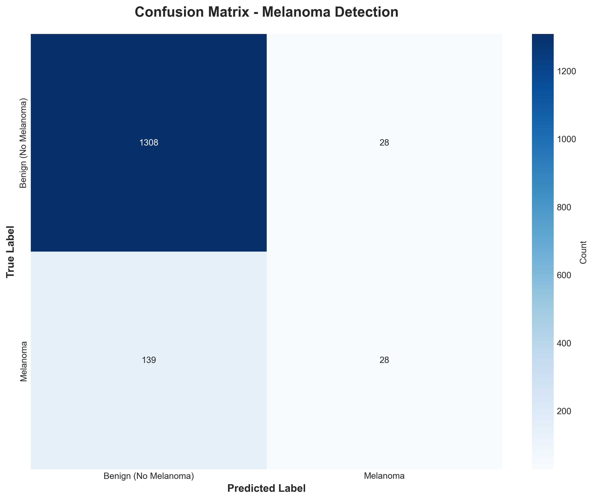
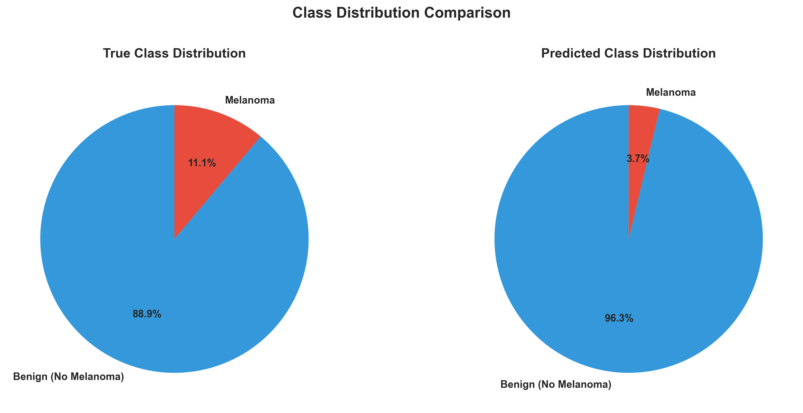
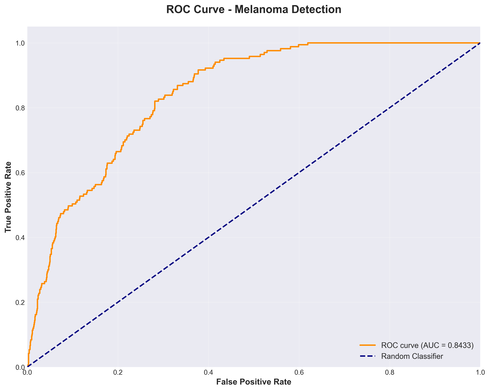
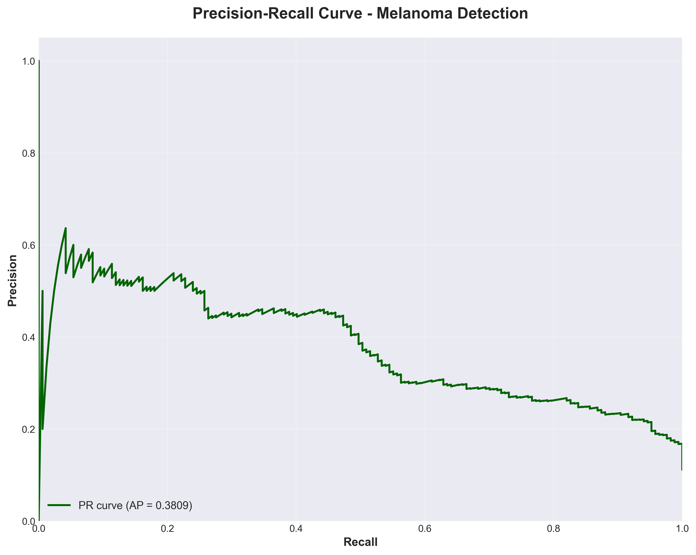
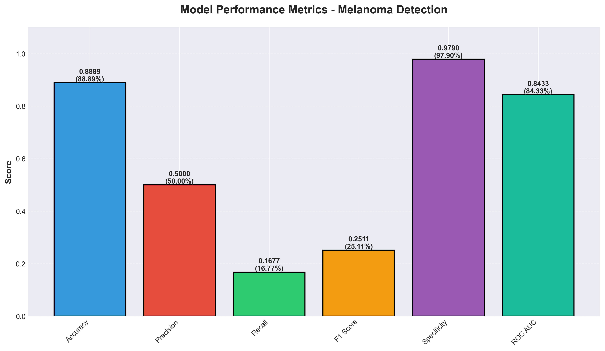
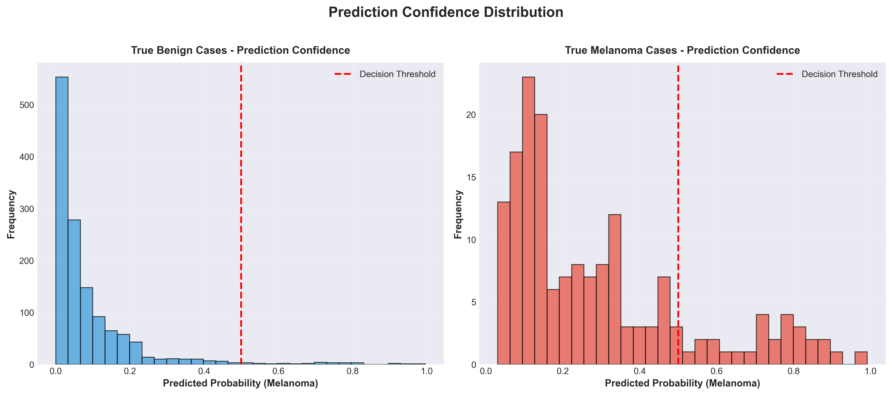

# Melanoma Detection Model - Inference Results

**Evaluation Date:** November 5, 2025  
**Model:** best_model_20251103_225237.h5  
**Test Samples:** 1,503  

---

## 📊 Model Performance Summary

### Overall Metrics

| Metric | Score | Percentage |
|--------|-------|------------|
| **Accuracy** | 0.8889 | **88.89%** |
| **Precision** | 0.5000 | 50.00% |
| **Recall (Sensitivity)** | 0.1677 | 16.77% |
| **F1 Score** | 0.2511 | 25.11% |
| **Specificity** | 0.9790 | **97.90%** |
| **ROC AUC** | 0.8433 | **84.33%** |
| **PR AUC** | 0.3809 | 38.09% |

---

## 🎯 Confusion Matrix Results

| Metric | Count | Description |
|--------|-------|-------------|
| **True Negatives (TN)** | 1,308 | Correctly identified as Benign |
| **False Positives (FP)** | 28 | Benign misclassified as Melanoma |
| **False Negatives (FN)** | 139 | Melanoma misclassified as Benign ⚠️ |
| **True Positives (TP)** | 28 | Correctly identified as Melanoma |

### Confusion Matrix Visualization


---

## 📈 Classification Report

```
                      precision    recall  f1-score   support

Benign (No Melanoma)     0.9039    0.9790    0.9400      1336
            Melanoma     0.5000    0.1677    0.2511       167

            accuracy                         0.8889      1503
           macro avg     0.7020    0.5734    0.5956      1503
        weighted avg     0.8591    0.8889    0.8635      1503
```

---

## 📊 Data Distribution

### Test Set Composition
- **Benign Cases:** 1,336 (88.89%)
- **Melanoma Cases:** 167 (11.11%)

### Class Distribution


---

## 📉 Performance Visualizations

### 1. ROC Curve (Receiver Operating Characteristic)
- **AUC Score:** 0.8433
- Shows the trade-off between True Positive Rate and False Positive Rate


### 2. Precision-Recall Curve
- **Average Precision:** 0.3809
- Shows the trade-off between Precision and Recall


### 3. Metrics Comparison
- Visual comparison of all performance metrics


### 4. Prediction Confidence Distribution
- Shows how confident the model is in its predictions


---

## 🔍 Key Insights

### Strengths ✅
1. **High Accuracy (88.89%):** The model correctly classifies most cases
2. **Excellent Specificity (97.90%):** Very good at identifying benign cases
3. **Low False Positive Rate (2.10%):** Rarely misclassifies benign as melanoma
4. **Good ROC AUC (0.8433):** Strong overall discriminative ability

### Areas for Improvement ⚠️
1. **Low Recall (16.77%):** Misses many melanoma cases (high false negatives)
2. **Moderate Precision (50.00%):** When predicting melanoma, only right half the time
3. **Low F1 Score (25.11%):** Poor balance between precision and recall for melanoma class
4. **Class Imbalance Impact:** Dataset has 8:1 ratio of benign to melanoma cases

### Clinical Implications 🏥
- **Conservative Classifier:** The model is very cautious about predicting melanoma
- **High False Negative Rate:** 83.23% of melanoma cases are missed (139 out of 167)
- **Safe False Positive Rate:** Only 2.10% of benign cases flagged as melanoma
- **Trade-off:** Prioritizes avoiding false alarms over detecting all melanomas

---

## 💡 Recommendations

### For Model Improvement:
1. **Address Class Imbalance:** 
   - Apply more aggressive data augmentation for melanoma class
   - Use different class weights during training
   - Consider oversampling or SMOTE techniques

2. **Optimize Decision Threshold:**
   - Current threshold: 0.5
   - Consider lowering to ~0.3-0.4 to improve recall
   - Accept slightly more false positives to catch more melanomas

3. **Ensemble Methods:**
   - Combine multiple models with different architectures
   - Use voting or stacking for better generalization

4. **Feature Engineering:**
   - Add attention mechanisms to focus on lesion boundaries
   - Incorporate metadata (age, location, size) if available

### For Clinical Deployment:
1. Use as a **screening tool** rather than diagnostic
2. Flag all positive predictions for expert review
3. Consider implementing a "uncertain" category for borderline cases
4. Regular model updates with new validated data

---

## 📁 Generated Files

All inference results are saved in the `inference/` directory:

1. **confusion_matrix.png** - Confusion matrix heatmap
2. **roc_curve.png** - ROC curve with AUC score
3. **precision_recall_curve.png** - PR curve with AP score
4. **metrics_comparison.png** - Bar chart of all metrics
5. **class_distribution.png** - Pie charts of class distribution
6. **prediction_confidence.png** - Histograms of prediction confidence
7. **classification_report.txt** - Detailed text report
8. **evaluation_metrics.json** - Machine-readable metrics
9. **INFERENCE_SUMMARY.md** - This comprehensive summary

---

## 🔬 Technical Details

### Model Architecture
- **Base Model:** EfficientNetB0 or Custom CNN
- **Input Size:** 224 × 224 × 3
- **Output:** Binary classification (Benign vs Melanoma)
- **Total Parameters:** ~5.3M

### Training Configuration
- **Dataset:** HAM10000
- **Epochs:** 10
- **Loss Function:** Binary Crossentropy
- **Optimizer:** Adam
- **Class Weights:** Applied for imbalanced data

### Evaluation Protocol
- **Test Set Size:** 1,503 images (15% of total)
- **Preprocessing:** Standardized to [0, 1] range
- **No data leakage:** Strict train/val/test split

---

## 📞 Contact & References

**Project:** Melanoma Detection System  
**Dataset:** HAM10000 (Harvard Dataverse)  
**Framework:** TensorFlow/Keras  
**Evaluation Date:** November 5, 2025

---

*Generated by Melanoma Detection Model Evaluation Pipeline*
